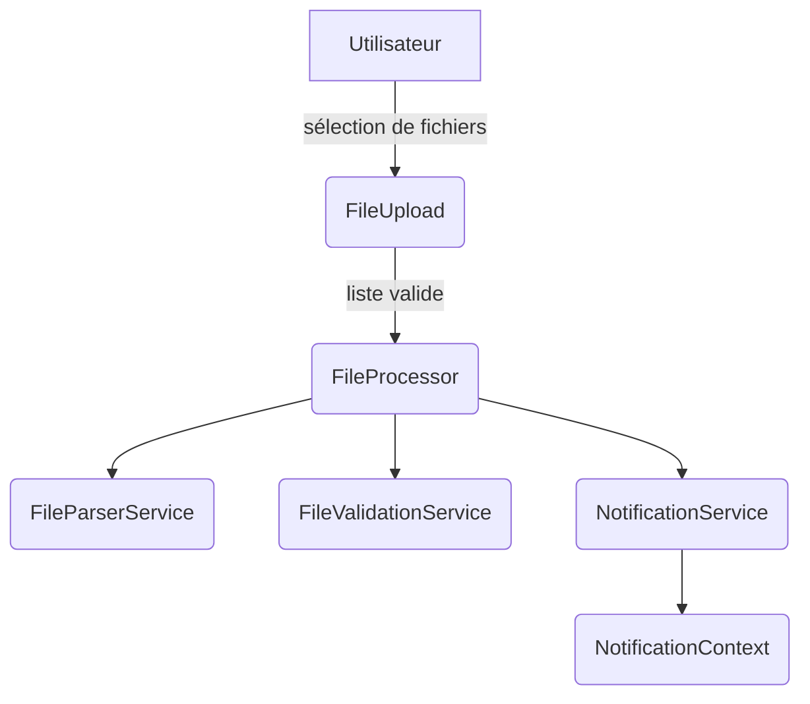

# Agents and Contribution Guide

All code and documentation changes must pass linting and tests by running:

```
npm run lint
npm test
```

This project is built with React and TypeScript. UI components should use Tailwind CSS for styling and icons from `lucide-react`. Avoid adding other UI or icon libraries unless specifically requested.

When implementing interfaces, produce polished, production-ready designs as described in `.bolt/prompt`.

Unit tests live in `src/utils/__tests__`. Update or add tests there whenever modifying utility code.

## Documentation

Project docs are stored in the `docs/` directory with the following structure:

- `docs/overview` – project overview
- `docs/guides` – how‑to guides and contribution info
- `docs/reference` – API and architecture references
- `docs/releases` – changelog and release notes

Start from [docs/index.md](docs/index.md) and see
[docs/guides/contributing.md](docs/guides/contributing.md) for contributor guidelines.
Refer to [docs/guides/documentation-style.md](docs/guides/documentation-style.md) for documentation conventions.

---

## Agents Overview

| Agent | Rôle principal | Fichier | Entrées | Sorties |
|-------|----------------|---------|---------|---------|
| **FileUpload** | Permet à l'utilisateur de sélectionner ou déposer des fichiers à traiter | `src/components/FileUpload.tsx` | `FileList` depuis l'interface | Appelle `FileProcessor` et affiche les erreurs de validation |
| **FileProcessor** | Orchestration du traitement des fichiers sélectionnés | `src/services/FileProcessor.ts` | `FileList`, setters React pour l'état | Met à jour la liste de `ProcessedFile` et déclenche la conversion JSON |
| **FileParserService** | Analyse le contenu d'un fichier texte pour extraire les données structurées | `src/services/FileParserService.ts` | Contenu texte brut | Tableau de `FileData` |
| **FileValidationService** | Vérifie la taille, l'extension et le nombre de fichiers, applique les limites de débit | `src/services/FileValidationService.ts` | `FileList` | Résultat de validation ou exception |
| **NotificationService** | Centralise les avertissements et permet aux composants de s'abonner | `src/services/NotificationService.ts` | Messages d'avertissement | Notifications via `NotificationContext` |

---

## Détails des agents

### `FileUpload`
- **Rôle** : Composant React offrant la zone de dépôt et la validation préliminaire des fichiers.
- **Entrées** : `FileList` via drag & drop ou sélection.
- **Sorties** : Appel de `onFilesSelected` avec les fichiers validés et affichage d'avertissements.
- **Dépendances** : `FileValidationService`, `NotificationContext`.

### `FileProcessor`
- **Rôle** : Lit chaque fichier, invoque `FileParserService` et gère l'état d'avancement.
- **Entrées** : `FileList`, `setProcessedFiles`, `setIsProcessing`.
- **Sorties** : Met à jour un tableau de `ProcessedFile` avec réussite ou erreur.
- **Dépendances** : `FileParserService`, `FileValidationService`, `notificationService`.

### `FileParserService`
- **Rôle** : Parse et convertit le contenu texte en données typées (`FileData`).
- **Entrées** : Chaîne de caractères du fichier.
- **Sorties** : Tableau d'objets `FileData` ou exception `ParsingError`.
- **Dépendances** : Fonctions de `src/utils/fileParser`.

### `FileValidationService`
- **Rôle** : Applique toutes les règles de sécurité (taille, extension, quota...).
- **Entrées** : `FileList` ou appels de contrôle de débit.
- **Sorties** : `ValidationResult` ou exceptions `ValidationError` / `RateLimitError`.
- **Dépendances** : Fonctions de `src/utils/securityValidator`.

### `NotificationService`
- **Rôle** : Stocke les avertissements et informe les abonnés lorsque la liste change.
- **Entrées** : Chaînes d'avertissement.
- **Sorties** : Notifications via la méthode `subscribe`.
- **Dépendances** : Aucune externe.

---

## Schéma d'interaction



---

## Ajouter un nouvel agent
1. Identifier une responsabilité unique à isoler.
2. Créer un fichier dédié dans `src/` avec une fonction ou classe exportée.
3. Documenter l'agent dans ce fichier et résumer son rôle ci‑dessous.
4. Ajouter des tests unitaires dans `src/utils/__tests__` ou un dossier de tests équivalent.

---

## Meilleures pratiques
* Chaque agent doit avoir une responsabilité claire et un point d'entrée explicite (`run`, `process`, etc.).
* Préférer des fonctions pures et de petite taille pour faciliter les tests.
* Mettre à jour ce fichier à chaque ajout ou modification d'agent.
* Lier `AGENTS.md` depuis le `README` pour faciliter l'onboarding.

---

## Mini-tâches recommandées
* [ ] Ajouter un lien vers `AGENTS.md` dans la section Documentation du `README.md`.
* [ ] S'assurer que tous les services disposent de tests unitaires.
* [ ] Créer éventuellement un `LoggingService` pour historiser les actions importantes.
