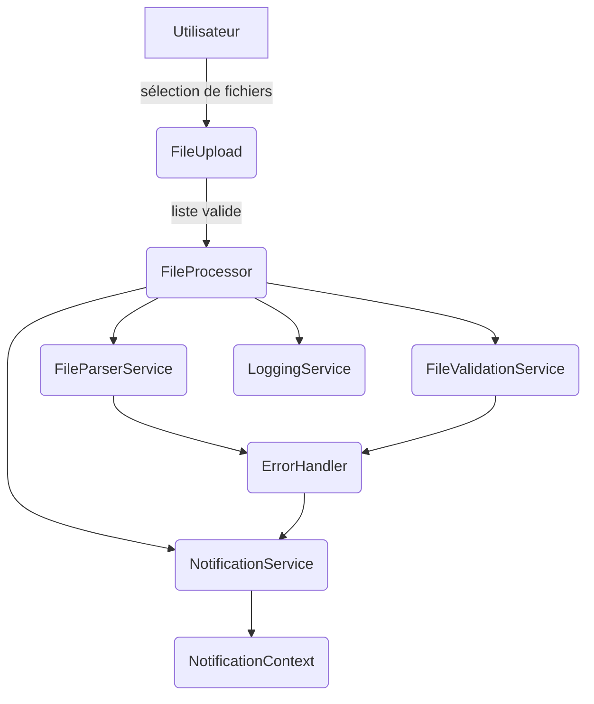

# 🤖 Agent Guide – Projet Postman_Runner_File_Processor

Ce dépôt fournit plusieurs « agents » (services et composants autonomes) chargés de traiter les fichiers Postman Runner côté client.  
Toute modification du code ou de la documentation doit être accompagnée d’un passage du lint et des tests :

```bash
npm run lint
npm test
```

Les interfaces utilisent React + TypeScript, avec Tailwind CSS et `lucide-react` pour les icônes. Aucune autre bibliothèque UI ne doit être ajoutée sans accord préalable.

---

## 1. Dev Environment Tips
> ℹ️ Comment configurer et lancer l’environnement local  

- **Node 18+ requis.** Vérifiez avec `node -v`.
- Installation des dépendances :
  ```bash
  npm install
  ```
- Démarrage de l’environnement de développement :
  ```bash
  npm run dev
  ```
- Lancement du script CLI :
  ```bash
  npm run build:cli && node dist/convert.js <files>
  ```
- La structure de la documentation se trouve dans `docs/` :
  - `docs/overview` – aperçu du projet
  - `docs/guides` – guides pratiques (contribution, installation…)
  - `docs/reference` – références API et architecture
  - `docs/releases` – notes de versions
  Consultez en priorité [docs/index.md](docs/index.md) puis [docs/guides/contributing.md](docs/guides/contributing.md).

---

## 2. Testing Instructions
> ⚠️ Les modifications doivent passer tous les tests et le lint

- **Lint** :
  ```bash
  npm run lint
  ```
- **Tests unitaires** (Vitest) :
  ```bash
  npm test
  ```
  Les utilitaires sont testés dans `src/utils/__tests__`.
- **Tests avancés** : voir [docs/guides/advanced-testing.md](docs/guides/advanced-testing.md).
- **CI** : `.github/workflows/ci.yml` exécute le lint, les tests unitaires et (optionnellement) les tests E2E sur Node 18 et 20.

---

## 3. Pull Request (PR) Instructions
- **Titre de PR** : `[nom_agent] Résumé concis`
- **Description** :
  1. Contexte et objectif
  2. Étapes pour tester (commande, options…)
  3. Impact éventuel sur les autres agents
- Avant d’ouvrir la PR :
  - Vérifiez que `npm run lint` et `npm test` passent.
  - Respectez les préfixes de branches indiqués dans [docs/guides/contributing.md](docs/guides/contributing.md) (`feature/`, `bugfix/`, `docs/`, etc.).
  - Les messages de commit doivent être clairs et en anglais.
- 🛠️ Attention : Toujours ajouter à la fin de votre commentaire PR les lignes suivantes pour le bot Codecov AI :
  - @codecov-ai-reviewer review
  - @codecov-ai-reviewer test
---

## 4. Codex/ChatGPT Usage Tips
> 🛠️ Conseils pour guider l’IA dans ce repo

- Ciblez un agent en restreignant la recherche à `src/services/<NomAgent>` ou `src/components/<NomAgent>`.
- Fournissez les logs ou messages d’erreur pour faciliter le débogage.
- Demandez un schéma Mermaid des interactions avant une refactorisation importante.
- Scindez les tâches complexes : réécriture, création de tests, mise à jour de la documentation.
- Pour le style de documentation, suivez [docs/guides/documentation-style.md](docs/guides/documentation-style.md).

---

## 5. Vue d’ensemble des agents
| Agent                   | Rôle principal                                                     | Fichier                                 | Entrées                                | Sorties                                   |
|-------------------------|-------------------------------------------------------------------|-----------------------------------------|----------------------------------------|-------------------------------------------|
| **FileUpload**          | Sélection/dépôt de fichiers et validation préliminaire            | `src/components/FileUpload.tsx`         | `FileList` depuis l’UI                 | Appelle `FileProcessor` et affiche les erreurs |
| **FileProcessor**       | Orchestration du traitement des fichiers                          | `src/services/FileProcessor.ts`         | `FileList`, setters React              | Met à jour `ProcessedFile[]` et déclenche la conversion JSON |
| **FileParserService**   | Analyse du contenu texte et génération JSON                       | `src/services/FileParserService.ts`     | Chaîne de texte                        | `FileData[]`                              |
| **FileValidationService**| Vérification de la taille, du type et du quota de fichiers       | `src/services/FileValidationService.ts` | `FileList`                             | `ValidationResult` ou exceptions          |
| **FileReaderService**   | Lecture du fichier avec délai maximal                             | `src/services/FileReaderService.ts`     | `File`, durée de timeout               | Texte ou erreur                           |
| **NotificationService** | Gestion des avertissements et abonnements                         | `src/services/NotificationService.ts`   | Messages d’avertissement               | Notifications via `NotificationContext`   |
| **LoggingService**      | Journalisation des actions et erreurs ([cycle des logs](docs/reference/events.md)) | `src/services/LoggingService.ts`        | Chaînes de log                         | Liste de logs                             |
| **FileHistoryService**  | Sauvegarde de l'historique des fichiers traités | `src/services/FileHistoryService.ts`    | `ProcessedFile`                        | Liste `ProcessedFile[]`                  |
| **ErrorHandler**        | Normalisation des messages d’erreur pour l’utilisateur            | `src/services/ErrorHandler.ts`          | `Error`                                | Chaîne nettoyée                           |
| **ProcessFileCommand**  | Traitement unitaire d’un fichier (command pattern)                | `src/services/ProcessFileCommand.ts`    | `File`, services de parsing/lecture    | Mise à jour de `ProcessedFile`            |

---

## 6. Détails par agent

### FileUpload
- **Rôle** : Composant React offrant la zone de dépôt et les contrôles de sécurité de base.
- **Entrées** : `FileList` (drag & drop ou input).
- **Sorties** : Appel de `onFilesSelected` avec les fichiers validés ; warnings via `NotificationContext`.
- **Dépendances** : `FileValidationService`, `NotificationContext`.
- **Tests** : `src/components/__tests__/FileUpload.test.tsx`.

### FileProcessor
- **Rôle** : Lit chaque fichier, invoque `FileParserService`, applique les validations et gère l’état de progression.
- **Entrées** : `FileList`, setters React.
- **Sorties** : Mise à jour de `ProcessedFile[]` avec réussite ou erreur.
- **Dépendances** : `FileParserService`, `FileValidationService`, `FileReaderService`, `NotificationService`, `LoggingService`.
- **Tests** : `src/services/__tests__/FileProcessor.test.ts`.

### FileParserService
- **Rôle** : Convertit le texte en données typées, puis en JSON téléchargeable.
- **Entrées** : Chaîne texte.
- **Sorties** : `FileData[]` ou exception de parsing.
- **Dépendances** : `src/utils/fileParser`, `parseStrategyRegistry`.
- **Tests** : `src/services/__tests__/FileParserService.test.ts`.

### FileValidationService
- **Rôle** : Applique toutes les règles de sécurité (taille maximale, extensions autorisées, quota…).
- **Entrées** : `FileList` ou appel de contrôle de débit.
- **Sorties** : `ValidationResult` ou `ValidationError`/`RateLimitError`.
- **Dépendances** : `src/utils/securityValidator`.
- **Tests** : `src/services/__tests__/FileValidationService.test.ts`.

### FileReaderService
- **Rôle** : Lit le fichier texte avec un timeout pour éviter les blocages.
- **Entrées** : `File`, durée de timeout.
- **Sorties** : Texte ou `FileReadError`.
- **Dépendances** : API `FileReader`.
- **Tests** : `src/services/__tests__/FileReaderService.test.ts`.

### NotificationService
- **Rôle** : Centralise les warnings et permet aux composants de s’abonner.
- **Entrées** : Chaînes d’avertissement.
- **Sorties** : Notifications via `subscribe`.
- **Dépendances** : aucune.
- **Tests** : `src/services/__tests__/NotificationService.test.ts`.

### LoggingService
- **Rôle** : Stocke les logs (info/erreur), possibilité d’exporter en JSON.
- **Entrées** : Messages texte.
- **Sorties** : Liste `LogEntry[]`.
- **Dépendances** : aucune (utilise `localStorage` si disponible).
- **Tests** : `src/services/__tests__/LoggingService.test.ts`.

### FileHistoryService
- **Rôle** : Stocke les fichiers traités et peut les sauvegarder dans `localStorage`.
- **Entrées** : `ProcessedFile` pour l’ajout, identifiant pour la suppression.
- **Sorties** : Historique `ProcessedFile[]`.
- **Dépendances** : `localStorage`.
- **Tests** : `src/utils/__tests__/fileHistoryService.test.ts`.

### ErrorHandler
- **Rôle** : Transforme toute exception en message utilisateur clair.
- **Entrées** : `Error` ou valeur inconnue.
- **Sorties** : Message nettoyé pour l’IHM.
- **Dépendances** : aucune.
- **Tests** : `src/services/__tests__/ErrorHandler.test.ts`.

### ProcessFileCommand
- **Rôle** : Encapsule le traitement d’un fichier (lecture, parsing, mise à jour d’état).
- **Entrées** : Fichier individuel et services nécessaires.
- **Sorties** : Mise à jour d’un élément `ProcessedFile`.
- **Dépendances** : `FileReaderService`, `FileParserService`, `ErrorHandler`, `LoggingService`.
- **Tests** : `src/services/__tests__/ProcessFileCommand.test.ts`.

---

## 7. Schéma d’interaction


---

## 8. Ajouter un nouvel agent
1. **Isoler une responsabilité unique** à traiter.
2. Créer `src/services/NomAgent.ts` (ou `src/components/NomAgent.tsx` selon le cas) et l’exporter.
3. Documenter son rôle dans le fichier et ici (section _Détails par agent_).
4. Ajouter des tests unitaires dans `src/utils/__tests__/` ou un dossier `__tests__` dédié.
5. Mettre à jour la documentation associée dans `docs/`.

---

## 9. Meilleures pratiques
- Un agent = une responsabilité (Single Responsibility).
- Points d’entrée explicites (`run()`, `process()`, etc.).
- Fonctions courtes et pures pour faciliter les tests.
- Dépendances injectées ou clairement déclarées.
- Mettre à jour `AGENTS.md` et la table ci-dessus à chaque évolution.
- Lier `AGENTS.md` depuis le `README` pour faciliter l’onboarding.

---

## 10. TODOs & Améliorations
- [ ] Ajouter un lien vers ce fichier dans la section Documentation du `README.md`.
- [ ] Vérifier que chaque service dispose de tests unitaires complets.
- [ ] Enrichir les schémas d’architecture et la documentation des évènements (logs, webhooks, etc.).
- [ ] Automatiser la génération du diagramme Mermaid via un script.

