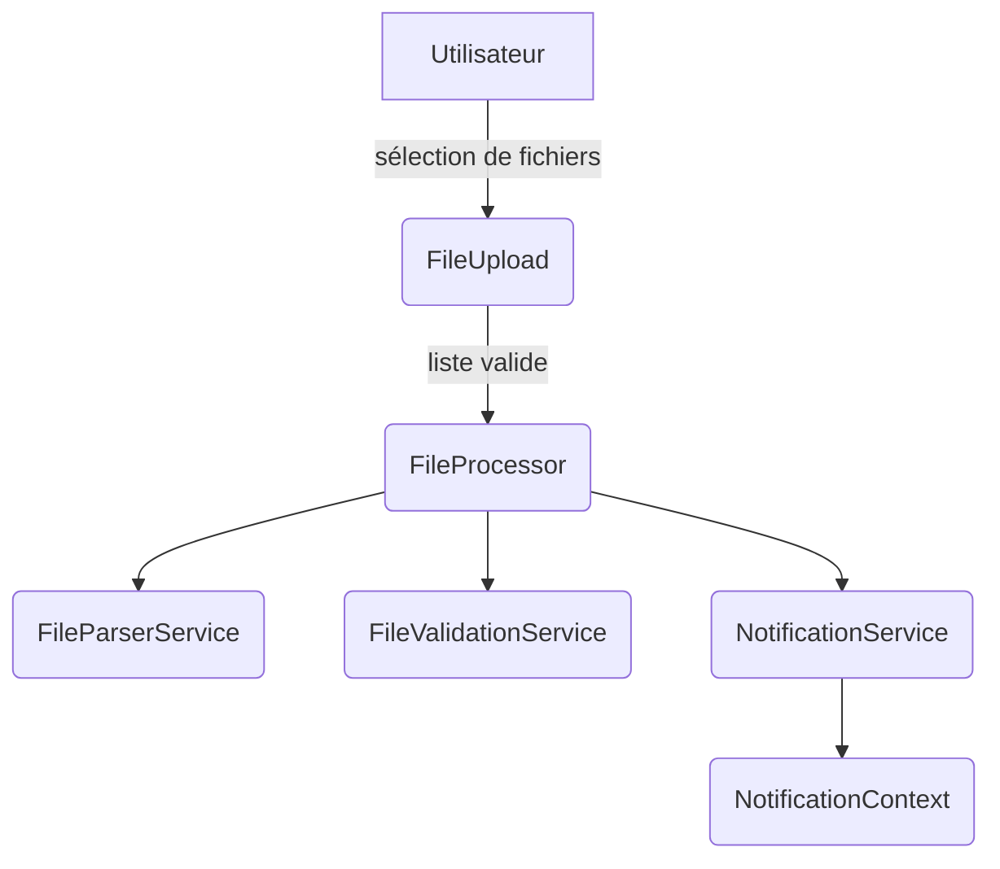

# Agents et guide de contribution

Toute modification de code ou de documentation doit passer le lint et les tests en lançant :

```
npm run lint
npm test
```

Ce projet utilise React et TypeScript. Les composants UI doivent utiliser Tailwind CSS pour le style et les icônes de `lucide-react`. N’ajoutez pas d’autres bibliothèques UI ou d’icônes sauf demande spécifique.

Pour les interfaces, produisez des designs soignés et prêts pour la production.

Les tests unitaires sont dans `src/utils/__tests__`. Mettez à jour ou ajoutez des tests lors de toute modification des utilitaires.

## Documentation

La documentation du projet se trouve dans le dossier `docs/` avec la structure suivante :

* `docs/overview` – aperçu du projet
* `docs/guides` – guides pratiques et informations de contribution
* `docs/reference` – références API et architecture
* `docs/releases` – journal des modifications et notes de versions

Commencez par [docs/index.md](docs/index.md) et consultez
[docs/guides/contributing.md](docs/guides/contributing.md) pour les règles du contributeur.
Référez-vous à [docs/guides/documentation-style.md](docs/guides/documentation-style.md) pour les conventions de rédaction documentaire, de code, de noms de variables et de l'affichage des messages d'erreurs.


---

## Agents Overview

| Agent                     | Rôle principal                                                                         | Fichier                                 | Entrées                               | Sorties                                                                |
| ------------------------- | -------------------------------------------------------------------------------------- | --------------------------------------- | ------------------------------------- | ---------------------------------------------------------------------- |
| **FileUpload**            | Permet à l'utilisateur de sélectionner ou déposer des fichiers à traiter               | `src/components/FileUpload.tsx`         | `FileList` depuis l'interface         | Appelle `FileProcessor` et affiche les erreurs de validation           |
| **FileProcessor**         | Orchestration du traitement des fichiers sélectionnés                                  | `src/services/FileProcessor.ts`         | `FileList`, setters React pour l'état | Met à jour la liste de `ProcessedFile` et déclenche la conversion JSON |
| **FileParserService**     | Analyse le contenu d'un fichier texte pour extraire les données structurées            | `src/services/FileParserService.ts`     | Contenu texte brut                    | Tableau de `FileData`                                                  |
| **FileValidationService** | Vérifie la taille, l'extension et le nombre de fichiers, applique les limites de débit | `src/services/FileValidationService.ts` | `FileList`                            | Résultat de validation ou exception                                    |
| **FileReaderService**     | Lit le contenu d'un fichier texte avec un délai maximum | `src/services/FileReaderService.ts`   | `File`, durée de timeout                | Chaîne de texte ou erreur                                    |
| **NotificationService**   | Centralise les avertissements et permet aux composants de s'abonner                    | `src/services/NotificationService.ts`   | Messages d'avertissement              | Notifications via `NotificationContext`                                |
| **LoggingService**        | Enregistre les actions et erreurs importantes                                          | `src/services/LoggingService.ts`        | Chaînes de log                        | Liste des entrées de log                                               |
| **ErrorHandler**          | Transforme les exceptions en messages utilisateur propres                              | `src/services/ErrorHandler.ts`          | `Error` capturées                     | Chaîne de message nettoyée                                             |

---

## Détails des agents

### `FileUpload`

- **Rôle** : Composant React offrant la zone de dépôt et la validation préliminaire des fichiers.
- **Entrées** : `FileList` via drag & drop ou sélection.
- **Sorties** : Appel de `onFilesSelected` avec les fichiers validés et affichage d'avertissements.
- **Dépendances** : `FileValidationService`, `NotificationContext`.

### `FileProcessor`

- **Rôle** : Lit chaque fichier, invoque `FileParserService` et gère l'état d'avancement.
- **Entrées** : `FileList`, `setProcessedFiles`, `setIsProcessing`.
- **Sorties** : Met à jour un tableau de `ProcessedFile` avec réussite ou erreur.
- **Dépendances** : `FileParserService`, `FileValidationService`, `FileReaderService`, `notificationService`.

### `FileParserService`

- **Rôle** : Parse et convertit le contenu texte en données typées (`FileData`).
- **Entrées** : Chaîne de caractères du fichier.
- **Sorties** : Tableau d'objets `FileData` ou exception `ParsingError`.
- **Dépendances** : Fonctions de `src/utils/fileParser`.

### `FileValidationService`

- **Rôle** : Applique toutes les règles de sécurité (taille, extension, quota...).
- **Entrées** : `FileList` ou appels de contrôle de débit.
- **Sorties** : `ValidationResult` ou exceptions `ValidationError` / `RateLimitError`.
- **Dépendances** : Fonctions de `src/utils/securityValidator`.

### `FileReaderService`

- **Rôle** : Lit le contenu d'un fichier texte en appliquant un délai maximal.
- **Entrées** : `File` et durée de timeout.
- **Sorties** : Chaîne de texte ou exception en cas d'erreur.
- **Dépendances** : APIs navigateur `FileReader`.

### `NotificationService`

- **Rôle** : Stocke les avertissements et informe les abonnés lorsque la liste change.
- **Entrées** : Chaînes d'avertissement.
- **Sorties** : Notifications via la méthode `subscribe`.
- **Dépendances** : Aucune externe.

### `LoggingService`

- **Rôle** : Conserve les messages d'information et les erreurs pour un suivi interne.
- **Entrées** : Chaînes de log via `logInfo` ou `logError`.
- **Sorties** : Tableau d'entrées accessible avec `getLogs`.
- **Dépendances** : Aucune externe.

### `ErrorHandler`

- **Rôle** : Nettoie et normalise les messages d'erreur avant affichage.
- **Entrées** : `Error` ou valeur inconnue.
- **Sorties** : Chaîne de message utilisateur.
- **Dépendances** : Aucune externe.

---

## Schéma d'interaction



---

## Ajouter un nouvel agent

1. Identifier une responsabilité unique à isoler.
2. Créer un fichier dédié dans `src/` avec une fonction ou classe exportée.
3. Documenter l'agent dans ce fichier et résumer son rôle ci‑dessous.
4. Ajouter des tests unitaires dans `src/utils/__tests__` ou un dossier de tests équivalent.

---

## Meilleures pratiques

- Chaque agent doit avoir une responsabilité claire et un point d'entrée explicite (`run`, `process`, etc.).
- Préférer des fonctions pures et de petite taille pour faciliter les tests.
- Mettre à jour ce fichier à chaque ajout ou modification d'agent.
- Lier `AGENTS.md` depuis le `README` pour faciliter l'onboarding.

---

## Mini-tâches recommandées

- [ ] Ajouter un lien vers `AGENTS.md` dans la section Documentation du `README.md`.
- [ ] S'assurer que tous les services disposent de tests unitaires.
- [ ] Créer éventuellement un `LoggingService` pour historiser les actions importantes.
