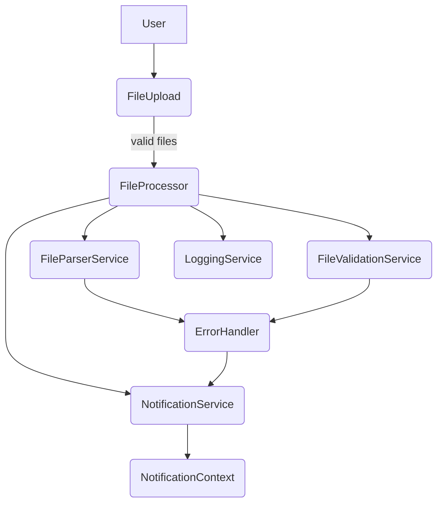

# Postman Runner File Processor


## 🚀 Objectif du projet

Cette application convertit des fichiers `.txt` générés par **Postman Runner** en JSON structuré directement dans le navigateur. Toutes les validations et l'assainissement sont effectués côté client. Un outil CLI est également disponible pour les conversions rapides.

## 🧰 Stack technologique

- [React 18](https://react.dev/) et [TypeScript 5](https://www.typescriptlang.org/)
- [Vite](https://vitejs.dev/) pour le bundling et le serveur de développement
- [Tailwind CSS](https://tailwindcss.com/) pour le style
- [lucide-react](https://lucide.dev/) pour les icônes
- [Vitest](https://vitest.dev/) et [Testing Library](https://testing-library.com/) pour les tests
- [ESLint](https://eslint.org/) et [Prettier](https://prettier.io/) pour la qualité du code

## 🔧 Installation

1. Vérifiez que Node.js 18 ou plus est installé :
   ```bash
   node -v
   ```
2. Installez les dépendances :
   ```bash
   npm install
   ```
3. Démarrez le serveur de développement :
   ```bash
   npm run dev
   ```
4. Exécutez la suite de tests :
   ```bash
   npm test
   ```
5. Générez la version production :
   ```bash
   npm run build
   ```
6. Prévisualisez la build localement :
   ```bash
   npm run preview
   ```

## ▶️ Lancement en CLI

Convertissez des fichiers en passant leur chemin en argument :

```bash
npm run cli -- fichier1.txt fichier2.txt
```

Chaque fichier `.txt` génère un fichier `.json` adjacent.

## 📦 Utilisation

Glissez-déposez vos fichiers dans l'interface ou cliquez sur **Choisir des fichiers**. Consultez les résultats et téléchargez le JSON généré pour chaque fichier traité. Un exemple détaillé se trouve dans [docs/guides/usage-example.md](docs/guides/usage-example.md).

## 🧠 Architecture



## 📁 Structure du projet

```
├─ src/            # Code source React/TypeScript
│  ├─ components/  # Composants UI
│  ├─ services/    # Services et logique métier
│  ├─ utils/       # Fonctions de parsing et validation
│  └─ config/      # Constantes de configuration
├─ docs/           # Documentation détaillée
├─ .github/        # Workflows CI
└─ README.md
```

## 🧪 Tests

Les tests unitaires se trouvent dans `src/utils/__tests__` et s'exécutent avec Vitest :

```bash
npm test
```

Assurez-vous que les nouveaux utilitaires sont couverts par des tests avant toute contribution.

## 🤝 Contribuer

Consultez [docs/guides/contributing.md](docs/guides/contributing.md) pour les étapes de contribution et les hooks Git. Les règles spécifiques aux agents sont décrites dans [AGENTS.md](AGENTS.md).

## 📚 Documentation liée

- [Documentation complète](docs/index.md)
- [Schémas d'architecture](docs/reference/architecture.md)
- [Changelog](docs/releases/changelog.md)

## 🛡️ Licence

Ce projet est distribué sous licence MIT.

---

### TODO

- [x] Ajouter un fichier `LICENSE` explicite
- [ ] Publier le package sur npm pour disposer d'un badge de version valide
- [x] Mettre en place un rapport de couverture (Codecov ou Coveralls)
