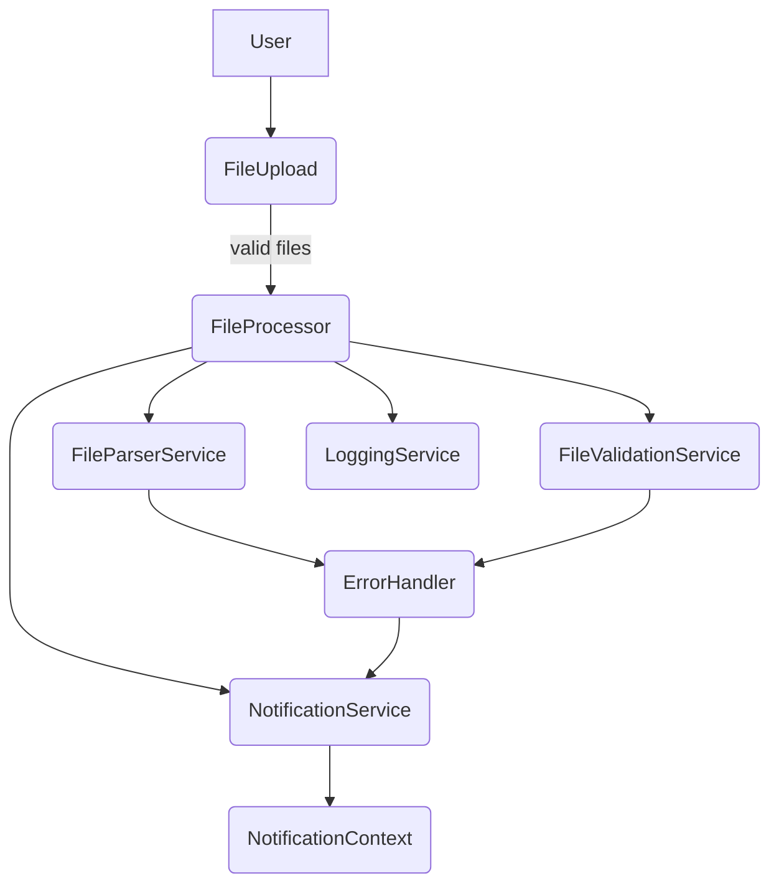

# Postman Runner File Processor


[](https://codecov.io/gh/Fr3doo/Postman_Runner_File_Processor)


## 🚀 Objectif du projet

Cette application convertit des fichiers `.txt` générés par **Postman Runner** en JSON structuré directement dans le navigateur. Toutes les validations et l'assainissement sont effectués côté client. Un outil CLI est également disponible pour les conversions rapides.

## 🧰 Stack technologique

- [React 18](https://react.dev/) et [TypeScript 5](https://www.typescriptlang.org/)
- [Vite](https://vitejs.dev/) pour le bundling et le serveur de développement
- [Tailwind CSS](https://tailwindcss.com/) pour le style
- [lucide-react](https://lucide.dev/) pour les icônes
- [Vitest](https://vitest.dev/) et [Testing Library](https://testing-library.com/) pour les tests
- [ESLint](https://eslint.org/) et [Prettier](https://prettier.io/) pour la qualité du code

## 🔧 Installation

1. Vérifiez que Node.js 18 ou plus est installé :
   ```bash
   node -v
   ```
2. Installez les dépendances :
   ```bash
   npm install
   ```
3. Démarrez le serveur de développement :
   ```bash
   npm run dev
   ```
4. Exécutez la suite de tests :
   ```bash
   npm test
   ```
5. Générez la version production :
   ```bash
   npm run build
   ```
6. Prévisualisez la build localement :
   ```bash
   npm run preview
   ```

## ▶️ Lancement en CLI

Générez d'abord le script autonome :

```bash
npm run build:cli
```

Un fichier `dist/convert.js` est créé. Exécutez-le avec Node en lui passant des
fichiers :

```bash
node dist/convert.js fichier1.txt fichier2.txt
```

Chaque fichier `.txt` produit un fichier `.json` adjacent dans le même dossier.

## 📦 Utilisation

Glissez-déposez vos fichiers dans l'interface ou cliquez sur **Choisir des fichiers**. Consultez les résultats et téléchargez le JSON généré pour chaque fichier traité. Un exemple détaillé se trouve dans [docs/guides/usage-example.md](docs/guides/usage-example.md).

## ⚙️ Configuration

Vous pouvez ajuster les limites de traitement dans un fichier `.env`. Le guide [docs/guides/configuration.md](docs/guides/configuration.md) liste les variables disponibles.

## 🧠 Architecture



## 📁 Structure du projet

```
├─ src/            # Code source React/TypeScript
│  ├─ components/  # Composants UI
│  ├─ services/    # Services et logique métier
│  ├─ utils/       # Fonctions de parsing et validation
│  └─ config/      # Constantes de configuration
├─ docs/           # Documentation détaillée
├─ .github/        # Workflows CI
└─ README.md
```

## 🧪 Tests

Les tests unitaires se trouvent dans `src/utils/__tests__`.
Lancez `npm test` pour exécuter la suite avec Vitest et obtenir un rapport de couverture.
Plusieurs fichiers sont exclus de l'analyse : consultez [docs/reference/tests-overview.md](docs/reference/tests-overview.md) pour la liste complète.
Veillez à couvrir les nouveaux utilitaires avant toute contribution.

## 🤝 Contribuer

Consultez [docs/guides/contributing.md](docs/guides/contributing.md) pour les étapes de contribution et les hooks Git. Les règles spécifiques aux agents sont décrites dans [AGENTS.md](AGENTS.md).

## 📚 Documentation liée

- [Documentation complète](docs/index.md)
- [Schémas d'architecture](docs/reference/architecture.md)
- [Changelog](docs/releases/changelog.md)
- [Guide de configuration](docs/guides/configuration.md)
- [Guide des agents](AGENTS.md)

## 📦 Publication sur npm

1. Vérifiez le numéro de version dans `package.json`.
2. Lancez `npm run build` pour générer `dist/`.
3. Exécutez `npm publish`.

## 🛡️ Licence

Ce projet est distribué sous licence MIT.

---
