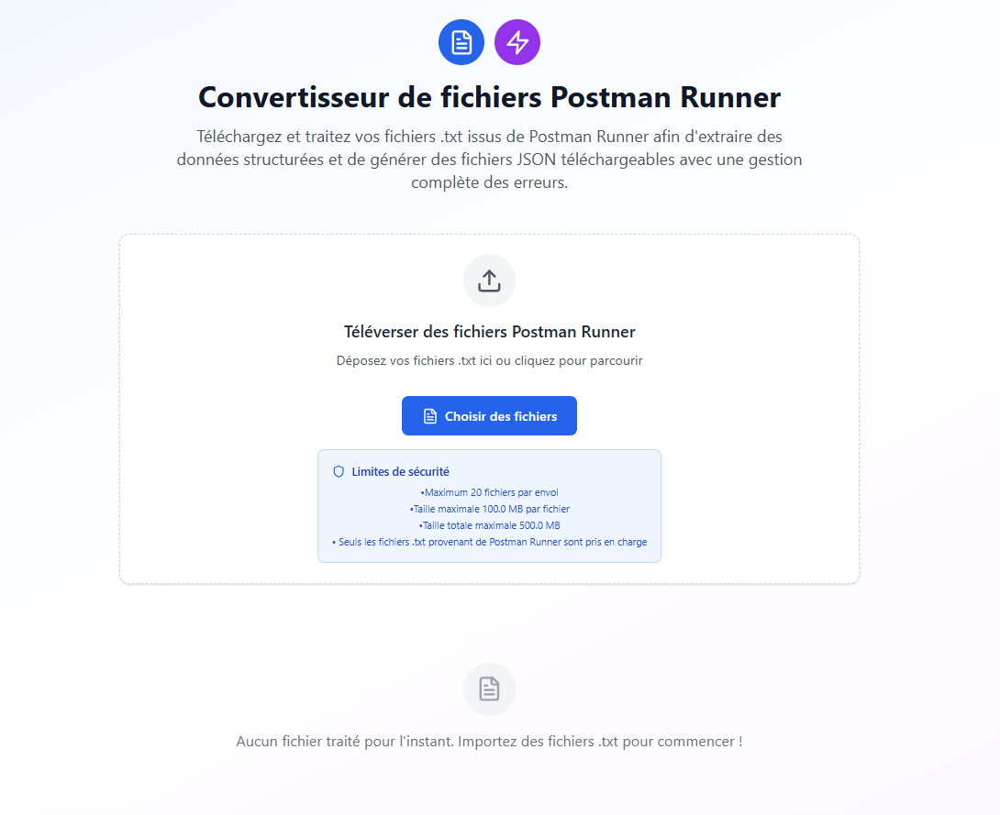

# Aperçu du projet

Le Postman Runner File Processor convertit les fichiers `.txt` issus de Postman Runner en JSON structuré. L’application fonctionne entièrement dans le navigateur avec React et TypeScript.

## Fonctionnalités principales

- Téléversement de fichiers par glisser-déposer avec retour de progression
- Analyse de chaque fichier pour extraire :

  - nombre de fichiers restants
  - numéro télédémarche
  - nom du projet
  - numéro de dossier
  - date de dépôt

- Téléchargement d’un fichier JSON pour chaque entrée traitée
- Affichage des statistiques de traitement et des erreurs
- Validation côté client du type, de la taille et du débit des fichiers
- [Référence de configuration de sécurité](../reference/security-config.md) détaillant ces limites
- Les avertissements sont collectés via un service de notification
- L’interface est enveloppée dans un ErrorBoundary pour une gestion d’échec élégante
