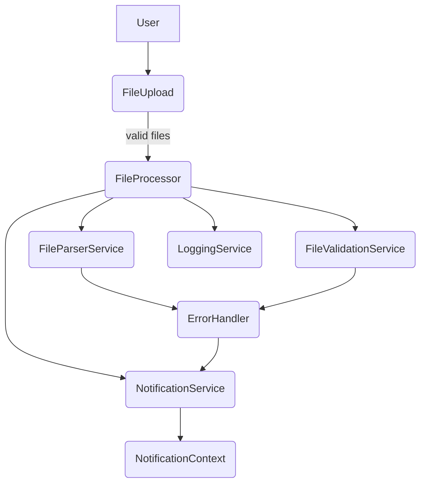

# Architecture

Le projet est une application React propulsée par Vite et écrite en TypeScript.

```
src/
├─ components/          Composants UI React
├─ config/              Constantes de configuration
├─ hooks/               Hooks React personnalisés
├─ services/            Services utilitaires
├─ utils/               Logique de parsing et validation
└─ types/               Types TypeScript partagés
```

Les tests unitaires se trouvent dans `src/utils/__tests__` et sont exécutés avec Vitest. Le style est géré avec Tailwind CSS et les icônes proviennent de `lucide-react`.

## Services clés

### LoggingService

Maintient une liste d’entrées de journal avec un niveau (`info` ou `error`), un message et un timestamp. Utilisez `logInfo` ou `logError` pour ajouter une entrée et `getLogs` pour les consulter.

### ConfigService

Lit les variables d’environnement et expose des constantes d’exécution. Accédez-y via `configService` pour obtenir des limites comme `concurrencyLimit` ou les paramètres imbriqués de `security`.

### ErrorHandler

Transforme les erreurs inconnues en chaînes courtes et lisibles. Appelez `errorHandler.handle(value)` avant d’afficher un message d’erreur à l’utilisateur.

## Vue d’ensemble des composants


