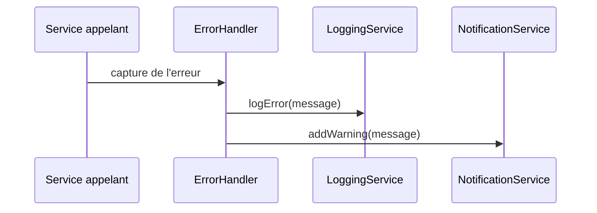

# Cycle des logs et des messages

Ce document décrit la circulation des messages dans l'application lorsque des événements surviennent.

## Étapes principales

1. **NotificationService** collecte les avertissements. Chaque appel à `addWarning` met à jour la liste interne et avertit les composants abonnés.
2. **LoggingService** enregistre toutes les actions importantes et les erreurs via `logInfo` ou `logError`. Les journaux sont conservés en mémoire et peuvent être exportés.
3. **ErrorHandler** transforme une exception en texte lisible. Ce texte est ensuite envoyé au `LoggingService` puis, si nécessaire, au `NotificationService` pour informer l'utilisateur.

Ainsi, lors d'une erreur :

Le cycle garantit que les erreurs sont journalisées et que l'interface reçoit un message court et sans caractère dangereux.
